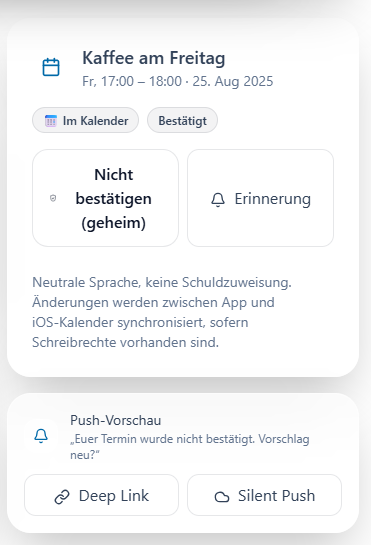
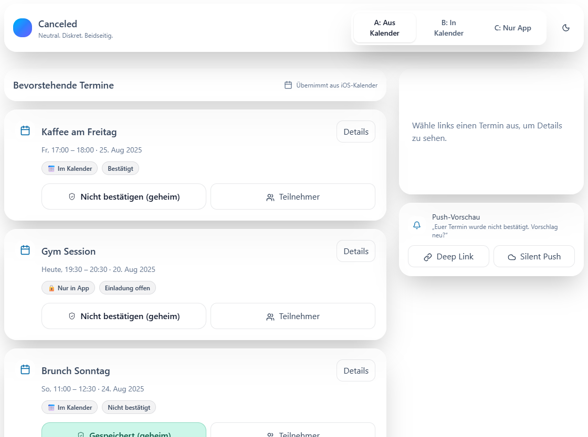

# 📅 Canceled – Neutral Mutual Cancel App

> **Diskret. Neutral. Beidseitig.**  
> Eine iOS-inspirierte App, die das Absagen von Terminen neu denkt:  
> Nur wenn **beide** Teilnehmer „Cancel“ drücken, wird der Termin neutral aufgelöst.  
> Kein schlechtes Gewissen, keine Schuldzuweisung.

---

## ✨ Features (MVP)

- 🔒 **Geheimes Cancel:** Nur wenn beide Parteien canceln, wird es sichtbar.  
- 📅 **Kalender-Integration:**  
  - **A:** Bestehende iOS-Kalender-Events „übernehmen“  
  - **B:** Neue Events in Canceled anlegen **und** in den iOS-Kalender schreiben  
  - **C:** Reine Canceled-Events ohne Kalender  
- ☁️ **Sync:** Firebase/Firestore als Backend, später auch andere Kalenderdienste.  
- 🔔 **Push Notifications:** Neutrale Pushes („Termin wurde nicht bestätigt. Vorschlag neu?“).  
- 🌓 **Design:** iOS-26 Liquid-Glass Look, helle Blautöne (Light) & eisige Blau/Weiß-Töne (Dark).  

---

## 🖼 Screenshots / Renderings

  

---

## 🚀 Tech Stack

- **Frontend:** SwiftUI (iOS first), später optional React Native/Flutter für Cross-Platform  
- **Backend:** Firebase (Firestore + Cloud Functions + Push / FCM)  
- **Calendar:** EventKit (iOS), später Erweiterung für Google/Outlook  
- **Auth:** Sign in with Apple  

---

## 🛠 Development Setup

> Hier steht noch nichts ;)

## 📌 Roadmap

[x] React-UI Prototype (Liquid Glass Concept)
[] iOS MVP mit SwiftUI & Firebase
[] Kalender-Hijack (Modus A)
[] Deep Link Invites
[] Silent Push Kalender-Cleanup
[] Cross-Platform (Android)

## 🤝 Contributing
Pull Requests welcome. Ideen & Feedback gerne über Issues.

## 📄 License
Apache 2.0

_Made with ♥️ in Tirol_

###### © Jonas Krödel 2025

